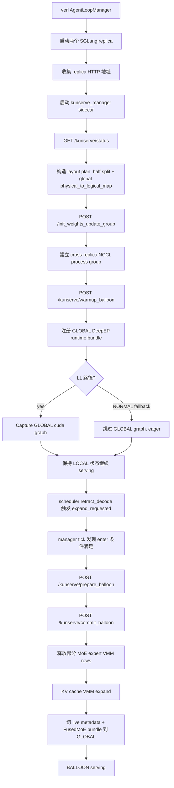
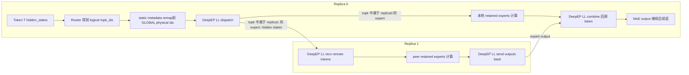
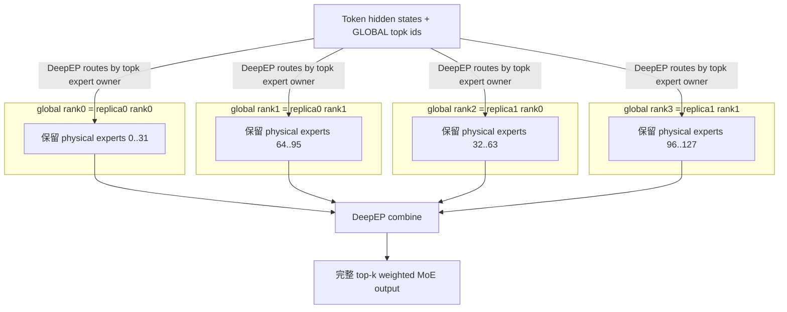

# KunServe 当前 DeepEP + Low-Latency 方案实现说明

> 目的：这份文档按当前代码解释 KunServe 在 BALLOON 之后如何通过 DeepEP Low-Latency 路径实现跨 replica 的 MoE expert sharing，以及一次 MoE infer 的完整链路。多数逻辑由 AI 辅助实现，因此这里尽量把代码入口、状态切换、通信关系和关键约束说清楚。

## 0. 一句话总结

当前 KunServe 的核心不是把两个 SGLang replica 合并成一个实例，而是：

```text
LOCAL 阶段：每个 replica 独立推理。
BALLOON 阶段：每个 replica 只保留一半互补的本地 MoE experts，释放另一半 expert 权重显存给 KV cache；
             MoE 层通过跨 replica DeepEP dispatch/combine，把 token hidden states 送到持有目标 expert 的 rank 上计算，
             再把 expert output combine 回原 token 所在 replica。
```

因此：

- **attention / dense / KV cache / scheduler / 请求队列**：仍然留在各自 replica 内部。
- **MoE expert 权重**：BALLOON 后两个 replica 互补保留，合起来覆盖完整 expert 集合。
- **跨 replica 通信**：只发生在 MoE 层的 hidden states dispatch/combine 上。
- **DeepEP LL 模式**：用于 decode 阶段的低延迟 token-to-expert dispatch/combine。

---

## 1. 关键代码入口

### 1.1 启动脚本

主要脚本：

```text
/workspace/verl/data/train/run_smoke_test_kunserve_tp2_dual_replica.sh
```

关键配置：

```bash
export SGLANG_EXPERIMENTAL_CUDA_VMM=1
export SGLANG_EXPERIMENTAL_VMM_MOE_WEIGHTS=1
export SGLANG_EXPERIMENTAL_VMM_KV_CACHE=1

actor_rollout_ref.rollout.tensor_model_parallel_size=2
actor_rollout_ref.rollout.data_parallel_size=1
actor_rollout_ref.rollout.expert_parallel_size=2
actor_rollout_ref.rollout.quantization=fp8

+actor_rollout_ref.rollout.kunserve_enable=True
+actor_rollout_ref.rollout.engine_kwargs.sglang.moe_a2a_backend=deepep
+actor_rollout_ref.rollout.engine_kwargs.sglang.moe_runner_backend=deep_gemm
+actor_rollout_ref.rollout.engine_kwargs.sglang.deepep_mode=auto
+actor_rollout_ref.rollout.engine_kwargs.sglang.ep_dispatch_algorithm=static
```

`SGLANG_KUNSERVE_GLOBAL_DEEPEP_NORMAL` 决定 GLOBAL bundle 使用 DeepEP NORMAL 还是 LL：

```bash
# 具备 verbs + nvidia_peermem，或 KUNSERVE_FORCE_IBGDA=1 时：
SGLANG_KUNSERVE_GLOBAL_DEEPEP_NORMAL=0   # GLOBAL 使用 DeepEP AUTO/LL，可尝试 GLOBAL cuda graph

# 否则：
SGLANG_KUNSERVE_GLOBAL_DEEPEP_NORMAL=1   # GLOBAL 强制 DeepEP NORMAL，跳过 GLOBAL cuda graph
```

本文重点讲 **LL 路径**，即：

```bash
SGLANG_KUNSERVE_GLOBAL_DEEPEP_NORMAL=0
KUNSERVE_DEEPEP_MODE=auto
```

其中 `deepep_mode=auto` 的语义是：

```text
prefill / extend 阶段 -> DeepEP NORMAL
Decode 阶段          -> DeepEP LOW_LATENCY
```

### 1.2 KunServe manager sidecar

独立包：

```text
/workspace/sglang/kunserve_manager/
```

主要文件：

```text
/workspace/sglang/kunserve_manager/kunserve_manager/cli.py
/workspace/sglang/kunserve_manager/kunserve_manager/controller.py
```

verl 侧在两个 SGLang HTTP server 都起来之后，由 `AgentLoopManager` 启动：

```text
/workspace/verl/verl/experimental/agent_loop/agent_loop.py
```

manager 做的事情：

1. 接收两个 replica 的 HTTP 地址。
2. 轮询 `/kunserve/status`。
3. 初始化跨 replica process group。
4. 调 `/kunserve/warmup_balloon` 预注册 GLOBAL runtime bundle。
5. 发现 `expand_requested=True` 后调 `/kunserve/prepare_balloon` + `/kunserve/commit_balloon`。

### 1.3 SGLang HTTP endpoints

```text
/workspace/sglang/python/sglang/srt/entrypoints/http_server.py
```

主要接口：

```text
GET  /kunserve/status
POST /kunserve/prepare_balloon
POST /kunserve/warmup_balloon
POST /kunserve/commit_balloon
POST /kunserve/restore_from_balloon
POST /init_weights_update_group
POST /destroy_weights_update_group
```

调用链大致是：

```text
HTTP endpoint
  -> tokenizer_manager communicator
  -> scheduler
  -> tp_worker
  -> model_runner
```

### 1.4 BALLOON runtime 核心代码

```text
/workspace/sglang/python/sglang/srt/model_executor/model_runner.py
```

重点函数：

```text
register_balloon_global_runtime_bundle()
_warmup_balloon_global_runtime()
warmup_balloon()
prepare_balloon()
commit_balloon()
restore_from_balloon()
_force_local_bundle_to_standard_dispatcher()
```

### 1.5 MoE dispatcher / DeepEP 代码

```text
/workspace/sglang/python/sglang/srt/layers/moe/fused_moe_triton/layer.py
/workspace/sglang/python/sglang/srt/layers/moe/token_dispatcher/deepep.py
/workspace/sglang/python/sglang/srt/layers/moe/token_dispatcher/standard.py
```

关键点：

- `FusedMoE` 支持 runtime bundle：`local` / `global`。
- `global` bundle 用 DeepEP dispatcher。
- LL 路径下，为避免 NVSHMEM double-init，`local` bundle 会被强制改为 StandardDispatcher。
- `DeepEPBuffer` 被改为按 `process group + dispatch mode` 缓存，避免 local/global 或 normal/LL buffer 互相覆盖。

---

## 2. 启动期：从两个 replica 到 GLOBAL process group

### 2.1 SGLang replica 布局

当前 smoke 配置通常是：

```text
N_GPUS_PER_NODE=4
TP=2
EP=2
replicas=2
```

物理上可以理解为：

```text
replica 0: GPU 0, GPU 1    local EP ranks 0,1
replica 1: GPU 2, GPU 3    local EP ranks 0,1
```

BALLOON 后需要一个 global EP world：

```text
global rank 0 = replica0 local rank0
global rank 1 = replica0 local rank1
global rank 2 = replica1 local rank0
global rank 3 = replica1 local rank1
```

manager 在 `KunServeController._ensure_process_group()` 里调用每个 replica 的：

```text
/init_weights_update_group
```

传参包括：

```python
{
  "master_address": replica0.host,
  "master_port": fresh_port,
  "rank_offset": replica_idx * local_ep_size,
  "world_size": 4,
  "group_name": "kunserve_global_ep_v<ts>_<attempt>",
  "backend": "nccl",
}
```

SGLang 端最终落到：

```text
ModelRunner.init_weights_update_group()
```

它用 `init_custom_process_group()` 建一个自定义 torch process group，并存到：

```python
self._model_update_group[group_name]
```

虽然名字叫 `model_update_group`，但 KunServe 复用了它作为 **cross-replica GLOBAL EP process group**。

---

## 3. Layout plan：两个 replica 如何互补保留 experts

manager 通过 `/kunserve/status` 读取每个 replica 的本地 expert layout，然后在：

```text
KunServeController._ensure_layout_plan()
```

构造：

```text
local_ep_size
local_routed_experts
retained_local_experts
offload_local_experts
global_world_size
global_physical_to_logical_map
replica_active_mappings
```

当前只支持两 replica 的对称 half split：

```text
retained_local_experts == offload_local_experts == local_routed_experts / 2
```

例如每个 local EP rank 有 64 个 routed experts，则：

```text
replica 0 active_local_expert_mapping = [0..31]
replica 1 active_local_expert_mapping = [32..63]
```

对于全局 physical expert domain，两个 replica 合起来覆盖完整 expert 集合。示意：

```text
原始每个 replica 都有完整 local expert rows:
  local rank0: physical 0..63
  local rank1: physical 64..127

BALLOON 后：
  replica0 保留 rank0 前半 + rank1 前半: [0..31, 64..95]
  replica1 保留 rank0 后半 + rank1 后半: [32..63, 96..127]
```

manager 把这个布局通过 payload 发给 SGLang：

```python
{
  "target_variant": "global",
  "runtime_ep_size": 4,
  "runtime_rank_offset": replica_idx * 2,
  "dispatch_rank_offset": replica_idx * 2,
  "active_local_expert_mapping": [...],
  "physical_to_logical_map": global_map,
  "process_group_name": self.group_name,
  "capture_cuda_graph": True,
}
```

---

## 4. warmup_balloon：预注册 GLOBAL bundle

manager 启动后会先执行 eager warmup：

```text
KunServeController.start()
  -> _wait_for_replicas_ready()
  -> _ensure_layout_plan()
  -> _ensure_process_group()
  -> _warmup_balloon()
```

`_warmup_balloon()` 并行调用两个 replica 的：

```text
POST /kunserve/warmup_balloon
```

SGLang 端：

```text
ModelRunner.warmup_balloon()
  -> _warmup_balloon_global_runtime()
  -> register_balloon_global_runtime_bundle()
  -> ensure_cuda_graph_variant_captured("global")  # LL 路径可 capture
```

warmup 的特点：

```text
只注册 GLOBAL runtime bundle + capture graph；
不切换 _balloon_state；
不释放 expert 权重；
不扩 KV cache；
业务请求仍然跑 LOCAL。
```

### 4.1 register_balloon_global_runtime_bundle 做了什么

核心函数：

```text
ModelRunner.register_balloon_global_runtime_bundle()
```

它做几件事：

1. 检查 `ep_dispatch_algorithm=static`。
2. 检查 GLOBAL 必须有 cross-rank A2A backend，`moe_a2a_backend=none` 直接报错。
3. 检查 DeepEP/Mooncake 路径要求 `moe_runner_backend=deep_gemm`。
4. 解析 manager 传来的 `process_group_name`，拿到 cross-replica process group。
5. 构造 GLOBAL expert location metadata。
6. 为每个 FusedMoE layer 注册 `variant="global"` 的 runtime bundle。

伪代码：

```python
runtime_group = self._resolve_balloon_process_group(process_group_name)
metadata = self._build_balloon_global_metadata(...)

for layer in fused_layers:
    dispatcher_local_expert_mapping = build_dispatcher_physical_expert_mapping(...)
    global_runner_config = replace(layer.local_bundle.moe_runner_config,
                                   num_local_experts=retained_count)

    layer.register_runtime_bundle(
        variant="global",
        moe_runner_config=global_runner_config,
        dispatcher=None or explicit_deepep_normal_dispatcher,
        group=runtime_group,
        moe_ep_size=global_world_size,
        moe_ep_rank=global_rank,
        active_local_expert_mapping=mapping,
        dispatcher_local_expert_mapping=dispatcher_local_expert_mapping,
        reduce_results=False,
    )
```

LL 路径下：

```text
SGLANG_KUNSERVE_GLOBAL_DEEPEP_NORMAL=0
```

所以 `explicit_global_dispatcher=None`，`register_runtime_bundle()` 会走默认的 `create_moe_dispatcher()`，由全局配置创建：

```text
MaybeTboDeepEPDispatcher(..., deepep_mode=get_deepep_mode())
```

也就是 `DeepEPMode.AUTO`。

NORMAL fallback 路径下：

```text
SGLANG_KUNSERVE_GLOBAL_DEEPEP_NORMAL=1
```

代码会显式构造：

```python
MaybeTboDeepEPDispatcher(..., deepep_mode=DeepEPMode.NORMAL)
```

并跳过 GLOBAL cuda graph capture。

### 4.2 LL 路径为什么要改 LOCAL bundle

在 `ModelRunner.__init__` 的 KunServe 初始化逻辑里有一段 gate：

```python
if SGLANG_EXPERIMENTAL_VMM_MOE_WEIGHTS and not SGLANG_KUNSERVE_GLOBAL_DEEPEP_NORMAL:
    self._force_local_bundle_to_standard_dispatcher()
```

含义：

- 当 GLOBAL 使用 DeepEP LL 时，DeepEP LL 会初始化 NVSHMEM。
- NVSHMEM 在单进程内基本只能按一个通信上下文初始化一次。
- 如果 LOCAL bundle 也默认 DeepEP，并且先初始化了 local TP group 的 NVSHMEM，后面 GLOBAL LL 再初始化 cross-replica group 可能触发 double-init 问题。
- 所以 LL 路径下，LOCAL bundle 被强制改成：

```text
StandardDispatcher + Triton runner + reduce_results=True
```

这样：

```text
LOCAL：不用 DeepEP / 不碰 NVSHMEM / 保持 local cuda graph
GLOBAL：唯一使用 DeepEP LL / 初始化一次 NVSHMEM / 走 cross-replica group
```

注意：如果 `SGLANG_KUNSERVE_GLOBAL_DEEPEP_NORMAL=1`，GLOBAL 强制 NORMAL 不初始化 NVSHMEM，因此当前代码不会强制 LOCAL 改 Standard。

---

## 5. commit_balloon：释放 expert 权重显存并切到 GLOBAL

触发点：scheduler 在 decode 时发现 KV 紧张，会在 `retract_decode` 路径设置：

```text
expand_requested=True
```

manager 轮询 `/kunserve/status`，满足条件后：

```text
KunServeController.tick()
  -> enter_balloon()
  -> /kunserve/prepare_balloon
  -> /kunserve/commit_balloon
```

### 5.1 prepare_balloon

如果 warmup 已经完成，prepare 基本是快速状态切换：

```text
state: local -> prepared
```

并确保 GLOBAL bundle/graph 已存在。

### 5.2 commit_balloon

核心函数：

```text
ModelRunner.commit_balloon()
```

做几件事：

1. 暂停 balloon graph replay。
2. 根据 `offload_local_experts` 从 MoE VMM-backed 权重里 borrow head/tail rows。
3. 把 donor segments 映射给 KV cache VMM 区域。
4. 扩大 `token_to_kv_pool_allocator` 的容量。
5. 更新 live expert location metadata 为 GLOBAL metadata。
6. 所有 FusedMoE layer 切换到 `global` runtime bundle。
7. 设置：

```text
_balloon_state = "balloon"
_balloon_offloaded_local_experts = offload_local_experts
_balloon_added_slots = added_slots
_balloon_graph_replay_enabled = True
```

示意：

```text
before commit:
  replica0: full experts + KV capacity X
  replica1: full experts + KV capacity Y

after commit:
  replica0: retained experts [0..31,64..95] + larger KV
  replica1: retained experts [32..63,96..127] + larger KV
  live metadata: GLOBAL physical_to_logical_map
  FusedMoE runtime: global
```

---

## 6. BALLOON 后单层 MoE infer 全链路

下面描述 decode 阶段，也就是 DeepEP LL 的主要目标路径。

### 6.1 输入仍在本 replica

请求没有迁移。假设 token T 属于 replica0：

```text
replica0 scheduler / KV / attention 持有 token T
replica1 不持有 token T 的 KV，也不调度这个 request
```

进入某个 MoE layer 前，replica0 本地已有该 token 的 hidden states。

### 6.2 Router + static expert id remap

MoE router 先给出 logical expert ids：

```text
topk_ids_logical = [e10, e37, e80, ...]
```

BALLOON commit 后，live expert location metadata 已切到 GLOBAL metadata。

`ep_dispatch_algorithm=static` 会让 logical expert id 映射到 GLOBAL dispatch domain 中的 physical expert id。这样 DeepEP 看到的 topk ids 不是“本地 replica 原始逻辑布局”，而是“两个 replica 互补保留后的 global physical 布局”。

这一步很关键，否则 token 会被发到错误 rank 或错误 expert row。

### 6.3 FusedMoE 使用 global runtime bundle

commit 后每个 FusedMoE layer 已执行：

```text
switch_runtime_bundle("global")
```

因此当前层使用：

```text
global dispatcher = MaybeTboDeepEPDispatcher
global runner     = deep_gemm
global group      = cross-replica process group
global ep size    = 4
global rank       = replica_rank * local_ep_size + local_ep_rank
reduce_results    = False
```

`reduce_results=False` 的原因：DeepEP combine 已经负责把 routed expert outputs 聚合回 token 原位；如果 FusedMoE 末尾再对 local TP group 做 all-reduce，会重复聚合。

### 6.4 DeepEP AUTO 解析为 LL

DeepEP dispatcher 在运行时根据当前 batch 是 prefill/extend 还是 decode 决定模式：

```python
resolved_deepep_mode = self.deepep_mode.resolve(is_extend_in_batch)
```

在 decode 阶段：

```text
is_extend_in_batch = False
DeepEPMode.AUTO -> LOW_LATENCY
```

所以走：

```text
_DeepEPDispatcherImplLowLatency
```

### 6.5 LL dispatch

代码位置：

```text
sglang/srt/layers/moe/token_dispatcher/deepep.py
_DeepEPDispatcherImplLowLatency.dispatch_a / dispatch_b
```

核心调用：

```python
buffer.low_latency_dispatch(
    hidden_states,
    topk_ids,
    num_max_dispatch_tokens_per_rank,
    num_experts,
    use_fp8=...,  # 默认通信量化，除非 SGLANG_DEEPEP_BF16_DISPATCH=1
    async_finish=...,
    return_recv_hook=...,
)
```

效果：

```text
对于每个 token 的 top-k expert：
  如果目标 expert 在本 rank retained experts 中 -> 本地接收/计算
  如果目标 expert 在 peer replica retained experts 中 -> hidden states 经 DeepEP 发到 peer rank
```

LL dispatch 输出的是当前 rank 需要计算的 packed recv tokens，以及对应 topk ids / weights / masked_m / expected_m。

### 6.6 本地 retained expert 计算

`FusedMoE.run_moe_core()` 调：

```python
self.quant_method.apply(layer=self, dispatch_output=dispatch_output)
```

在当前配置下：

```text
moe_runner_backend=deep_gemm
quantization=fp8
```

所以 expert GEMM 走 DeepGEMM 相关路径。

每个 rank 只计算自己 retained 的 expert rows。

### 6.7 LL combine

代码位置：

```text
_DeepEPDispatcherImplLowLatency.combine_a / combine_b
```

核心调用：

```python
buffer.low_latency_combine(
    x=hidden_states,
    topk_idx=topk_ids,
    topk_weights=topk_weights,
    handle=self.handle,
    async_finish=...,
    return_recv_hook=...,
)
```

效果：

```text
把各 rank 计算出的 expert outputs 按 dispatch handle 反向发回 token 原位，
并按 topk_weights 做 combine，最终原 replica 得到完整 MoE output。
```

combine 后，token T 的 hidden states 回到 replica0 的执行链路中。

### 6.8 后续层继续本地执行

MoE output 返回后：

```text
residual / norm / attention / dense
```

仍然在原 replica 的 TP ranks 内部执行。KV cache 不迁移。

---

## 7. BALLOON 后 MoE infer 流程图

### 7.1 控制面流程



### 7.2 数据面：单个 MoE layer 的 DeepEP LL 路径



### 7.3 四个 global EP ranks 的视角



---

## 8. DeepEPBuffer 的本地改动

当前 `deepep.py` 里的 `DeepEPBuffer` 不是原始单例 buffer，而是按：

```text
process group id
  -> dispatch mode NORMAL / LOW_LATENCY
      -> buffer entry
```

缓存。

数据结构：

```python
_buffer_cache: dict[int, dict[DeepEPDispatchMode, _DeepEPBufferEntry]]
_dispatch_mode_by_group: dict[int, DeepEPDispatchMode]
_default_dispatch_mode: Optional[DeepEPDispatchMode]
```

这样做是为了：

1. LOCAL / GLOBAL group 不互相覆盖 buffer。
2. NORMAL / LL buffer 不互相覆盖。
3. cuda graph capture 时可以记录当时的 dispatch mode。
4. 避免 AUTO 模式下先初始化一种 buffer，后续另一种模式复用错配置。

LL buffer 会检查：

```text
hidden_size
param_bytes
num_max_dispatch_tokens_per_rank
num_experts
```

如果同一个 group+LL mode 下配置不同，会直接报错，避免静默错用 buffer。

---

## 9. 关键环境与运行条件

### 9.1 想跑 GLOBAL DeepEP LL，需要

```bash
SGLANG_KUNSERVE_GLOBAL_DEEPEP_NORMAL=0
KUNSERVE_DEEPEP_MODE=auto
KUNSERVE_MOE_A2A_BACKEND=deepep
KUNSERVE_MOE_RUNNER_BACKEND=deep_gemm
```

并且一般需要：

```text
/dev/infiniband 可见
nvidia_peermem 或 nv_peer_mem 已加载
ulimit -l unlimited
NVSHMEM / IBGDA 可初始化
```

脚本里的 preflight 当前是：

```text
有 verbs + 有 peermem -> 自动 SGLANG_KUNSERVE_GLOBAL_DEEPEP_NORMAL=0
否则 -> fallback NORMAL
```

也可以用：

```bash
KUNSERVE_FORCE_IBGDA=1
```

绕过 preflight 强制测试 LL/IBGDA。

### 9.2 LL 与 NORMAL 的差异

| 项目 | DeepEP LL | DeepEP NORMAL fallback |
|---|---|---|
| 触发条件 | `SGLANG_KUNSERVE_GLOBAL_DEEPEP_NORMAL=0` | `SGLANG_KUNSERVE_GLOBAL_DEEPEP_NORMAL=1` |
| Decode 模式 | `AUTO -> LOW_LATENCY` | 强制 NORMAL |
| NVSHMEM | 会使用 | 当前实现中尽量跳过 |
| GLOBAL cuda graph | 目标是 capture/replay | 跳过 GLOBAL graph，eager |
| 性能目标 | 低延迟 | 功能兜底，慢 |
| 主要风险 | IBGDA/NVSHMEM 初始化、peermem | eager 动态 shape 开销大 |

---

## 10. 当前实现的几个关键设计取舍

### 10.1 为什么不合并实例

因为 live merge 需要迁移/合并：

```text
req_to_token
token_to_kvcache
prefix/radix tree
scheduler queues
sampling state
HTTP stream
cuda graph
process groups
```

当前方案避免这些迁移：请求和 KV 永远不动，只跨 replica 发送 MoE hidden states。

### 10.2 为什么 GLOBAL 用 DeepEP 而不是 StandardDispatcher

`StandardDispatcher` 的 baseline 语义是：

```text
所有 EP ranks 一开始就持有同一个 batch hidden states；
各 rank 只算本地 expert partial；
最后 all-reduce partial output。
```

跨 replica 时，peer replica 没有你的 request hidden states，也没有你的 KV/scheduler 状态。DeepEP 正好解决这个问题：它只把 MoE 所需的 hidden states dispatch 到目标 expert owner，算完再 combine 回来。

### 10.3 为什么 GLOBAL `reduce_results=False`

在 baseline StandardDispatcher 中，MoE core 只产生本 rank partial output，所以需要：

```python
tensor_model_parallel_all_reduce(final_hidden_states)
```

但 DeepEP combine 已经把 top-k expert outputs 聚合回 token 原位，因此 GLOBAL bundle 设置：

```text
reduce_results=False
```

避免重复 all-reduce。

### 10.4 为什么要 `ep_dispatch_algorithm=static`

BALLOON 后 physical expert layout 变了：两个 replica 互补持有 expert。router 输出的是 logical expert id，必须用 static metadata 映射到 GLOBAL physical expert id，否则 DeepEP 会按错误 expert owner 路由。

---

## 11. 快速 grep 验证点

一轮 run 后可以看：

```bash
grep -aE "PG ready|WARMUP|prepare start|commit done|variant switched|Capturing batches.*global|skip GLOBAL" \
  /workspace/verl/outputs/<RUN>/kunserve/verl_training.log
```

LL 成功时理想上应看到：

```text
[KUNSERVE-MS] PG ready ... world=4 backend=nccl
[KUNSERVE-MS] WARMUP dispatch warmup_balloon ...
Capturing batches ... variant='global'
[KUNSERVE-MS] commit done: state=balloon variant=global ...
```

如果看到：

```text
skip GLOBAL cuda graph capture: GLOBAL bundle is in DeepEP NORMAL mode
```

说明这轮不是 LL graph 路径，而是 NORMAL fallback。

